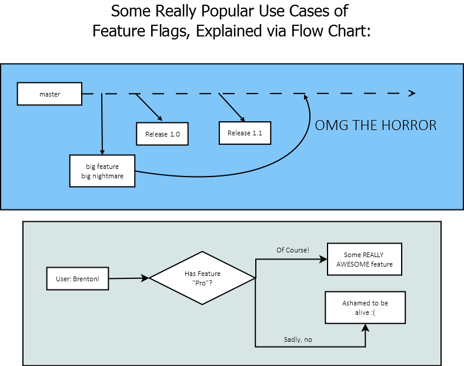

# FeatureFlags



Sometimes it makes sense for developers to push code into a pipeline (`master` as an example) without needing
to follow a normal merge cycle.  Sometimes, you want to push features out to a specific subset of customers.
Or sometimes you want to work in parallel with other features without having to worry about what breaking
changes will occur during a production deployment.

These are all issues that FeatureFlags attempts to resolve by introducing the concept of `Features`. If you 
are able to write code and push that code into production and have it live with only a subset of consumers,
you can quickly and easily test for feedback during development.  You can also implement these new features 
into a sales pitch when the features are actively being worked on.  The possibilities are endless.

# Builds
Release branch (`master`)

[](https://travis-ci.org/brentonlamar/FeatureFlags) 

Development branch (`develop`)

[](https://travis-ci.org/brentonlamar/FeatureFlags)

# Toggles
Toggles are bits of code that actually perform the actions of deciding "Is this feature available?"  There
are a few default toggles created as a starting point in this library, but it's really simple to create your own
as well.

## BoolFeatureToggle
Sometimes you simply want to turn a feature on in a development environment, but you don't want that feature to 
go live in production just yet.  That is the idea behind the `BoolFeatureToggle`.

To create a new feature toggle, simply derive from the `BoolFeatureToggle` class:

```c#
public class EmailReceiptFeature : BoolFeatureToggle { }
```

Also, be sure to register the key in your `Web.config` or `App.config` file.  Note that the name expected
is `FeatureFlags.` followed by the class name.  For the `BoolFeatureToggle`, you may specify "true", "false", 1 or 0.

```
<appSettings>
    <add key="FeatureFlags.EmailReceiptFeature" value="true"/>
</appSettings>
```

Now, simply use the class.

```c#
var emailReceiptFeature = new EmailReceiptFeature();
if (emailReceiptFeature.Enabled)
{
    // Email the receipt
}
```

## DateRangeFeatureToggle
Maybe you want to turn on a feature during a specific time frame.  That's the idea behind the `DateRangeFeatureToggle`.

All the steps are the same as the `BoolFeatureToggle`.

```c#
public class BlackFridaySaleFeature : DateRangeFeatureToggle { }
```

Now, register the date range in your config file.  Note that you must register two dates, and by default the dates are seperated by a pipe (but that can be changed if you like).

```
<appSettings>
    <add key="FeatureFlags.BlackFridaySaleFeature" value="2016-11-25 12:00:00 AM | 2016-11-25 11:59:59 PM"/>
</appSettings>
```

Again, use the class.

```c#
var blackFridaySaleFeature = new BlackFridaySaleFeature();
if (blackFridaySaleFeature.Enabled)
{
    // Enable the "purchase" actions.
}
```

## BeforeDateFeatureToggle
Maybe you want to have a feature enabled _before_ a certain date/time.  That's the idea behind the `BeforeDateFeatureToggle`.

All the steps are the same as the `BoolFeatureToggle`.

```c#
public class BlackFridaySaleFeature : BeforeDateFeatureToggle { }
```

Now, register the date in your config file.

```
<appSettings>
    <add key="FeatureFlags.BlackFridaySaleFeature" value="2023-11-25 12:00:00 AM"/>
</appSettings>
```

Again, use the class.

```c#
var blackFridaySaleFeature = new BlackFridaySaleFeature();
if (blackFridaySaleFeature.Enabled)
{
    // Enable the "purchase" actions.
}
```

## AfterDateFeatureToggle
Sometimes, you want to have a feature enabled *after* a certain date/time.  Thus, use the `AfterDateFeatureToggle`.

All the steps are the same as the `BoolFeatureToggle`.

```c#
public class BlackFridaySaleFeature : AfterDateFeatureToggle { }
```

Now, register the date in your config file.

```
<appSettings>
    <add key="FeatureFlags.BlackFridaySaleFeature" value="2016-11-25 12:00:00 AM"/>
</appSettings>
```

Again, use the class.

```c#
var blackFridaySaleFeature = new BlackFridaySaleFeature();
if (blackFridaySaleFeature.Enabled)
{
    // Enable the "purchase" actions.
}
```

## IdListFeatureToggle
Sometimes, you have an id of a user, merchant, role, etc. and you want to enable specific features for those users.
Enter the `IdListFeatureToggle`.

Please note that only `int` values are supported at this time, but there are plans to expand to all types, especially 
`Guid` and `string` types.

```c#
public class ProfessionFeatureToggle : IdListFeatureToggle 
{
    public ProfessionFeatureToggle(int userId) : base(userId) { }
}
```

Register the list of ids that can utilize the feature (note that this is a comma seperated list):

```
<appSettings>
    <add key="FeatureFlags.ProfessionFeatureToggle" value="300,12,90"/>
</appSettings>
```

Finally, use the class.

```c#
var professionalFeature = new ProfessionFeatureToggle(UserContext.UserId);
if (professionalFeature.Enabled)
{
    // Enable the "purchase" actions.
}
```

# Providers
Providers are a simple but effective way to swap out the implementation of _how_ you define where the
feature settings are stored.  There is only one interface that you must inherit, `IFeatureProvider`,
and that will take a `string key` and send out the value of that key.

## AppSettingsProvider 
This is the default provider that gets the feature configuration from the AppSettings / Web.config file.
All default instances of Toggles use this provider.

## MssqlSettingsProvider
This is a handy provider that will run a specific query and return the *single* resultset.  You _must_ craft 
your query in a way that there will only be a single resultset, similar to how the AppSettingsProvider would
read a single "value".

To use this provider, simply pass it into the toggle you'd like to overload.  Then, you must specify a query in
your configuration file.  

You may also provide query parameters to the provider by adding to the `ParameterValues` dictionary.  Your query
parameters must conform to the standard (ie, start with an `@` symbol and be found within the query), and the values
will be attempted to be run as strings.

# Advanced Usage
